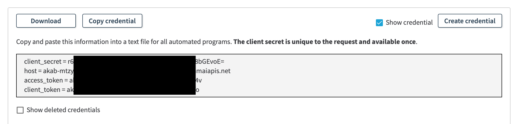
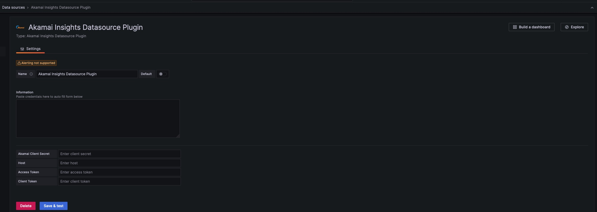
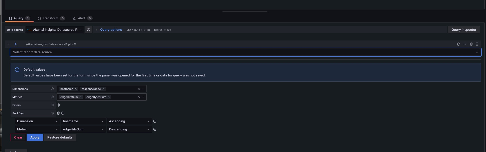
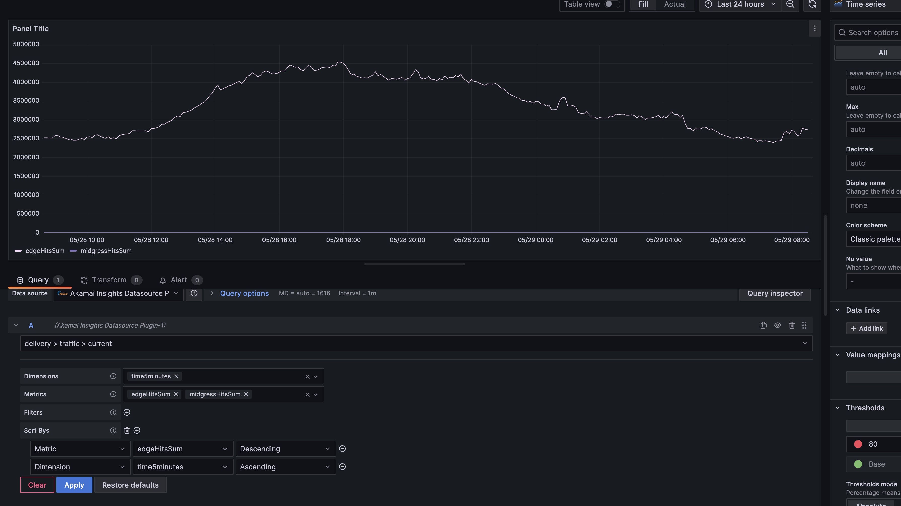
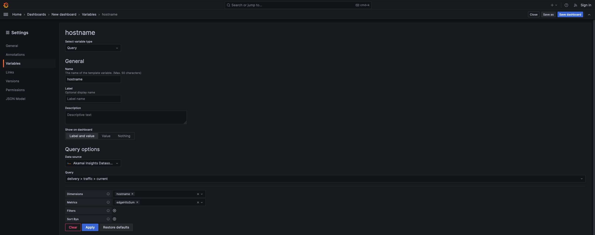

# Akamai Insights Datasource Plugin
Use Akamai Insights Datasource Plugin for Grafana to visualize and observe reporting data. 
The plugin gets data from the [Reporting API v2](https://techdocs.akamai.com/reporting/v2/reference/api).

## Prerequisites
Before using Akamai Insights Datasource Plugin, you need to:
* Install Grafana 7.0 or newer
* Get Akamai API credentials for the Reporting API v2.


### Install Grafana 7.0 or newer
Note that your package manager may install an older version, so follow the official documentation on [installing Grafana](https://grafana.com/docs/grafana/latest/installation/) for details of the Grafana installation process for various operation systems.

## Get Akamai API credentials
To use the [Reporting API v2](https://techdocs.akamai.com/reporting/v2/docs/welcome-rpt), you need to create an API client with authentication credentials. See how to [get started](https://techdocs.akamai.com/reporting/v2/reference/get-started).

To create your authentication credentials for the Reporting API:
* Go to [Control Center](https://control.akamai.com/)
* Navigate to the **Identity & Access** page.
* Under **Users and API Clients**, click **Create API client**.


* Click **Advanced**.
* Choose **Select APIs**.
* Select **Reporting API** and **READ-WRITE** access.


* Click **Create API client**.
* Copy the credentials (client_secret, host, access_token, and client token). You’ll later enter them into your Akamai Insights Datasource Plugin configuration.



Read more about [creating authentication credentials](https://techdocs.akamai.com/developer/docs/set-up-authentication-credentials). 
To learn how to apply authentication in a variety of programming languages when using Akamai APIs, refer to [Authenticate with EdgeGrid](https://techdocs.akamai.com/developer/docs/authenticate-with-edgegrid).

## Installing this plugin on a local Grafana

### Linux OSs (Debian, Ubuntu, CentOS, Fedora, OpenSuse)

Configuration file: /etc/grafana/grafana.ini  
Plugin directory: /var/lib/grafana/plugins  
Log directory: /var/log/grafana/

* You may have to use 'sudo' to edit the configuration file or to view the log file.
* You may have to change permissons on the 'plugin' directory, for example: sudo chmod 777 /var/lib/grafana/plugins 

1. Under the plugin directory (/var/lib/grafana/plugins), create a directory called 'akamai-insights-datasource-plugin'.
2. From the dist directory, copy these to /var/lib/grafana/plugins/akamai-insights-datasource-plugin:
   - LICENSE
   - README.md
   - img (directory and its contents)
   - module.js
   - module.js.LICENSE.txt
   - module.js.map
   - plugin.json
3. From the unzipped archive, copy one of these (as appropriate for your hardware) to /var/lib/grafana/plugins/akamai-insights-datasource-plugin:
   - gpx_akamai-insights-datasource-plugin_linux_amd64
   - gpx_akamai-insights-datasource-plugin_linux_arm
   - gpx_akamai-insights-datasource-plugin_linux_arm64  

### macOS

Configuration file: /usr/local/etc/grafana/grafana.ini  
Plugin directory: /usr/local/var/lib/grafana/plugins  
Log directory: /usr/local/var/log/grafana/

1. Under the plugin directory (/usr/local/var/lib/grafana/plugins), create a directory called 'akamai-insights-datasource-plugin'.
2. From the unzipped archive, copy these to /usr/local/var/lib/grafana/plugins/akamai-insights-datasource-plugin:
   - LICENSE
   - README.md
   - img (directory and its contents)
   - module.js
   - module.js.LICENSE.txt
   - module.js.map
   - plugin.json
3. From the unzipped archive, copy this to /var/lib/grafana/plugins/akamai-insights-datasource-plugin:
   - gpx_akamai-insights-datasource-plugin_darwin_amd64  

### Windows

Grafana can be installed into any directory (install_dir).

Configuration file: install_dir\conf  
Plugin directory: install_dir\data\plugins  
Log directory: install_dir\data\log

1. Under the plugin directory (install_dir\data\plugins), create a directory called 'akamai-insights-datasource-plugin'.

2. From the unzipped archive, copy these to install_dir\data\plugins\akamai-insights-datasource-plugin:
   - LICENSE
   - README.md
   - img (directory and its contents)
   - module.js
   - module.js.LICENSE.txt
   - module.js.map
   - plugin.json

3. From the unzipped archive, copy this to install_dir\data\plugins\akamai-insights-datasource-plugin:
   - gpx_akamai-insights-datasource-plugin_windows_amd64.exe

### Configure Grafana

Read [Configuration](https://grafana.com/docs/grafana/latest/administration/configuration/) for configuration directions for each operating system.

1. Open the configuration file in a text editor.
2. Under the [paths] section header, uncomment plugins by removing the semicolon (;).
3. To the right of plugins =, insert the complete path to the plugin directory.
   NOTE: The plugin directory differs by operating system. For example:
```
[paths]
# Directory where grafana will automatically scan and look for plugins
plugins = /var/lib/grafana/plugins
```
4. Under the [plugins] section header, uncomment "allow_loading_unsigned_plugins".
5. To the right of "allow_loading_unsigned_plugins =", add "akamai-insights-datasource" (without quotes). For example:
```
[plugins]
# Enter a comma-separated list of plugin identifiers to identify plugins that are allowed to be loaded even if they lack a valid signature.
allow_loading_unsigned_plugins = akamai-insights-datasource
```
6. Restart Grafana See how to [Restart Grafana](https://grafana.com/docs/grafana/latest/installation/restart-grafana/) for each operating system. Under the log directory for your operating system, in "grafana.log", you should see something similar to:
```
t=2021-03-24T10:31:09-0400 lvl=info msg="Registering plugin" logger=plugins id=akamai-insights-datasource
```

See [Troubleshooting](https://grafana.com/docs/grafana/latest/troubleshooting/) for troubleshooting tips.

## Configure Akamai Insights Datasource Plugin
1. [Log in to Grafana](https://grafana.com/docs/grafana/latest/getting-started/getting-started/). The default username/password are: admin/admin.
2. Select **Configuration** (gear icon) -> **Data Sources** -> **Akamai Insights Datasource Plugin**
3. In the data source configuration panel, enter your Akamai API credentials.

4. Save your changes

You can now use the plugin.

## Use Akamai Insights Datasource Plugin
1. In Grafana, create a new dashboard and add a visualization.
2. Select a previously created data source.
3. In the **Select report data source field**, choose a report. You can use [all reports](https://techdocs.akamai.com/reporting/v2/reference/available-reports), supported by the Reporting API v2.
4. Create your report’s query. Select metrics, dimensions, filters, and SortBys for your report. At startup, the plugin loads the default metrics and dimensions for a given report. See the report documentation under [Available reports](https://techdocs.akamai.com/reporting/v2/reference/available-reports) for more information.

5. Click **Apply**.
6. Create additional queries, as needed. 

You can now monitor your report data.



### Use query-based variables
The plugin lets you use variables of the Query type. 
1. Add a variable and set its query options. The first dimension you select in the form is then used as the variable value in Grafana.
2. [Use the created variable](https://grafana.com/docs/grafana/latest/dashboards/variables/variable-syntax/) in your visualization queries. 



